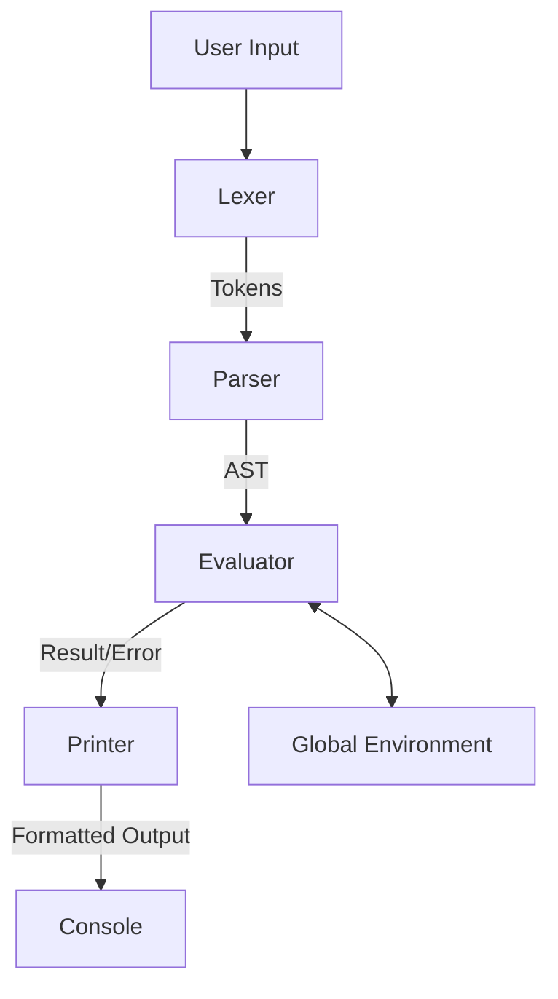

# REPL Architecture

This document outlines the high-level architecture for the **REPLngne** project. All four implementations (Rust, Go, C, Zig) will adhere to this common structure to ensure consistency and facilitate cross-language performance comparisons.

## Core Components

The REPL loop consists of four distinct phases:

1.  **Read (Input Handling)**
    *   **Goal:** Capture user input efficiently, handling multi-line editing, history navigation, and signal interrupts (Ctrl+C).
    *   **Implementation:** We will use a robust line-editing library or implement a custom raw-mode TTY handler where necessary.
    *   **Output:** A raw string of source code.

2.  **Eval (Parsing & Execution)**
    *   **Lexer (Tokenizer):** Converts the raw source string into a stream of tokens.
    *   **Parser:** Consumes tokens to build an Abstract Syntax Tree (AST). We will use a Recursive Descent Parser for simplicity and extendability.
    *   **Evaluator:** Traverses the AST and executes the logic.
        *   *Tree-Walk Interpreter:* Direct execution of the AST nodes. (Phase 1)
        *   *Bytecode VM:* Compilation to bytecode for a stack-based virtual machine. (Phase 2 - Performance Optimization)

3.  **Print (Output Formatting)**
    *   **Goal:** Display the result of the evaluation in a readable format.
    *   **Features:** Syntax highlighting for code blocks, clear error messages with line numbers, and distinct formatting for different data types (e.g., colors for strings vs. numbers).

4.  **Loop (Control Flow)**
    *   **Goal:** Maintain the application state and handle the lifecycle.
    *   **Environment:** A persistent store for variables and function definitions defined during the session.

## Data Flow

## Error Handling

*   **Lexer Errors:** Invalid characters, unterminated strings.
*   **Parser Errors:** Syntax errors, unexpected tokens.
*   **Runtime Errors:** Type mismatches, division by zero, undefined variables.

Each implementation must provide a robust error reporting mechanism that highlights the specific location of the error in the input line.
